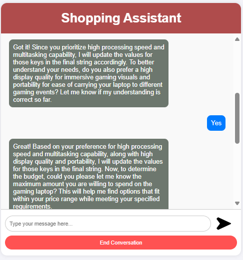

# GenAI-based-Shopping-Assistant
This AI agent , Shoping Assitant , is built on langGraph and aims to provide decisive shopping experience to all people using the power of LLM.It uses tavily for web search , and llama-3.1-70B-versatile model through groq. This ai agent is made using totally open source technologies.

 

  

  

  

  

  

